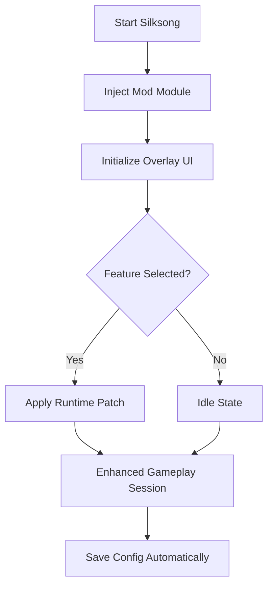

# 🦋 Hollow Knight: Silksong Mod Menu Overview

The **Hollow Knight: Silksong Mod Menu** is a refined customization suite designed for players who want to shape their journey through Pharloom with total precision.
From combat fluidity to map freedom, this menu transforms Silksong into a personal sandbox for exploration, testing, and performance mastery — all while maintaining the game’s elegant aesthetic and flow.

Whether you’re refining your parry timing, exploring inaccessible areas, or crafting cinematic no-death runs, this tool gives you the power to **play your way**.

---

## ⚙️ Core Features

**🎯 Combat & Movement Enhancements**

* *Infinite Silk* – Perform techniques and heals endlessly.
* *God Mode Toggle* – Immunity from traps, spikes, and fall damage.
* *Perfect Parry* – Auto-time counters and ripostes with frame accuracy.
* *Speed Multiplier* – Adjust Hornet’s agility and dash cooldowns.

**🗺 Exploration & Navigation**

* *Full Map Reveal* – Instantly uncover every region of Pharloom.
* *Teleport System* – Warp between benches or boss arenas.
* *Double Jump & Wall Glide Enhancer* – Stack mobility upgrades for testing routes.
* *Light Aura* – Permanent charm-based illumination in dark areas.

**💠 Utility & Customization**

* Custom overlay (`Insert` key toggle).
* Adjustable themes (Silk White, Abyss Black, or Crimson).
* Real-time stat readouts for speedrunners.
* Multi-profile configuration system.

---

## 🧩 Compatibility Table

| Platform      | Supported  | Notes                         |
| ------------- | ---------- | ----------------------------- |
| Windows 10/11 | ✅          | Native DirectX 11 overlay     |
| Steam         | ✅          | Fully stable with 1.0+ builds |
| GOG           | ⚙️ Partial | Requires manual path linking  |
| Gamepad Input | ✅          | Navigate with D-Pad           |

> [!NOTE]
> Launch Silksong **before** starting the loader for automatic memory sync.

---

## 🚀 Quick Setup Guide

1. **Download** the `Silksong_ModMenu.zip` package.
2. **Extract** it into your game’s root folder.
3. **Run** `SilksongLoader.exe` as Administrator.
4. Wait for the message `Overlay Connected`.
5. Press `Insert` in-game to open the Mod Menu.

Example config snippet:

```ini
[Player]
InfiniteSilk=True
GodMode=False
SpeedMultiplier=1.5
ParryAssist=True

[Map]
RevealAll=True
TeleportEnabled=True
QuickWarpKey=F7

[Hotkeys]
ToggleMenu=Insert
QuickHeal=F6
PanicDisable=F12
```

---

## 🧠 Logic Flow Diagram



---

## 💻 Performance Overview

| Feature            | CPU Load | GPU Load | Latency Impact | Notes                              |
| ------------------ | -------- | -------- | -------------- | ---------------------------------- |
| Infinite Silk      | <1%      | None     | None           | Lightweight memory flag            |
| Map Reveal         | <1%      | None     | None           | One-time operation                 |
| ESP / Warp Overlay | 3%       | Low      | Minimal        | Disable in boss fights for clarity |
| Speed Modifier     | 1%       | None     | None           | Dynamic scaling supported          |

> [!IMPORTANT]
> Avoid using frame caps while the Mod Menu overlay is active; it syncs to in-game refresh rate for smoother transitions.

---

## 💡 Advanced Features

**🧬 Charm Configuration Editor**

* Modify equipped charm effects without visiting benches.
* Stack passive boosts like speed + regeneration + stealth.

**🕹 Movement Enhancer**

```ini
[Movement]
AirDash=True
TripleJump=True
ClimbSpeed=2.0
```

**🎨 UI Theme Customization**

```json
{
  "Theme": "Crimson",
  "Opacity": 0.9,
  "Font": "Nunito",
  "BorderGlow": true
}
```

> [!TIP]
> Combine *Infinite Silk* with *Perfect Parry* to practice combat routes without risking resets.

---

## ❓ FAQ

### 🦋 1. Is this mod safe?

Yes. It only applies temporary runtime modifications and never edits your save files or the game’s internal scripts.

### ⚔️ 2. Can I use it online?

The menu is **single-player only** and designed for offline use.

### 🔁 3. Does it auto-update?

Yes. The loader checks for version offsets and syncs patches automatically upon launch.

### 💾 4. Where are profiles stored?

All configs and presets are saved under `Documents\SilksongModMenu\Profiles\`.

### 🧠 5. Can I disable modules mid-play?

Absolutely. Press the toggle hotkey or deactivate specific features from the menu without restarting.

---

## 🌌 Performance & Visual Notes

| Module        | Effect                | Best Use               |
| ------------- | --------------------- | ---------------------- |
| Infinite Silk | Unlimited combat flow | Practice / Boss fights |
| Map Reveal    | Full exploration      | 100% Completion        |
| Teleport      | Quick travel          | Speedruns              |
| Parry Assist  | Timing automation     | Challenge runs         |

> [!WARNING]
> Avoid enabling “One-Hit Mode” while using scripted boss events — it may break progression triggers.

---

## 🏁 Final Thoughts

The **Hollow Knight: Silksong Mod Menu** empowers players to explore, experiment, and perfect their gameplay at any level. Whether you’re testing advanced combat routes or building a cinematic experience for streaming, this menu provides clean control with zero compromise to performance or atmosphere.

Fluid, elegant, and powerful — it’s everything Hornet deserves.


---

**Hollow Knight: Silksong Mod Menu** — shape your journey, master your motion, and explore Pharloom without limits.
